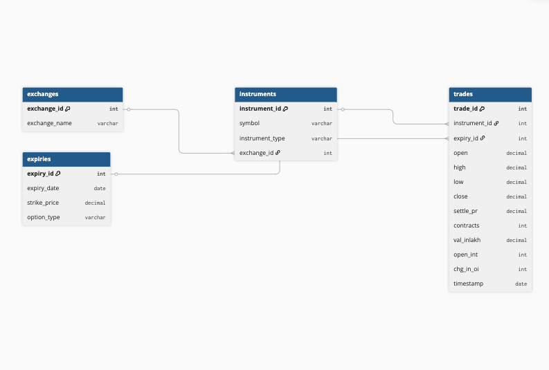

# NSE Futures & Options — Relational Database
**Assignment: Senior Data Associate — Qode Advisors LLP**  
**Author: Keziya Kurian**  
**Database:** DuckDB | **Language:** Python + SQL

---

## Overview

This project designs and implements a **normalized relational database** to store and analyze **2,533,210 rows** of NSE Futures & Options (F&O) data sourced from Kaggle. The schema supports multi-exchange analysis (NSE, BSE, MCX), powers 5 advanced SQL queries, and is built to scale for 10M+ row HFT ingestion.

---

## Repository Structure

```
qode-fno-database/
├── README.md                       ← Design rationale (this file)
├── diagrams/
│   └── er_diagram.png              ← ER Diagram (entities, PKs, FKs, cardinality)
├── schema/
│   ├── ddl.sql                     ← CREATE TABLE + INDEX statements
│   └── setup_db.py                 ← Runs DDL and creates DuckDB tables
├── notebooks/
│   └── ingest.py                   ← Loads Kaggle CSV into 4 normalized tables
└── queries/
    ├── analysis.sql                ← 5 SQL analysis queries with comments
    └── optimization.sql            ← Indexes + EXPLAIN ANALYZE + partitioning
```

---

## Dataset

**Source:** [NSE F&O Dataset 3M — Kaggle](https://www.kaggle.com/datasets/sunnysai12345/nse-future-and-options-dataset-3m)

| Property | Value |
|---|---|
| Total rows | 2,533,210 |
| Columns | 16 |
| Period | Aug–Oct 2019 |
| Exchange | NSE (equity F&O only) |

**Raw columns:** `INSTRUMENT`, `SYMBOL`, `EXPIRY_DT`, `STRIKE_PR`, `OPTION_TYP`, `OPEN`, `HIGH`, `LOW`, `CLOSE`, `SETTLE_PR`, `CONTRACTS`, `VAL_INLAKH`, `OPEN_INT`, `CHG_IN_OI`, `TIMESTAMP`

---

## Schema Design

### ER Diagram


### Tables

| Table | Rows | Purpose |
|---|---|---|
| `exchanges` | 3 | Exchange lookup — NSE, BSE, MCX |
| `instruments` | 328 | Unique SYMBOL + INSTRUMENT_TYPE combinations |
| `expiries` | 18,232 | Unique EXPIRY_DT + STRIKE_PR + OPTION_TYP combinations |
| `trades` | 2,533,210 | Core fact table — daily OHLC, volume, open interest |

### Relationships (Cardinality)
```
exchanges  ──< instruments  (one exchange → many instruments)
instruments ──< trades      (one instrument → many daily trade records)
expiries   ──< trades       (one expiry contract → many trade records)
```

---

## Design Rationale

### 1. Normalization (3NF) — Why We Split the CSV into 4 Tables

The raw CSV repeats `SYMBOL`, `INSTRUMENT`, `EXPIRY_DT`, `STRIKE_PR`, and `OPTION_TYP` across all 2.5M rows. Storing these strings repeatedly:
- **Wastes storage** — `BANKNIFTY` stored 2.5M times as a 9-char string vs once as an integer ID
- **Causes inconsistency** — a typo like `BankNifty` breaks all queries
- **Makes updates costly** — renaming a symbol requires updating millions of rows

**Normalization solution:** Store each unique value once in a lookup table and reference it with a small integer FK. This reduces the `trades` table to compact numeric IDs, making joins fast and data consistent.

---

### 2. Why Star Schema Was Avoided

A star schema denormalizes dimension data back into the fact table for faster reads at the cost of redundancy. We chose **3NF instead** because:

- **Data integrity > read speed**: F&O data is used for research and backtesting — correctness is non-negotiable. A star schema risks stale or inconsistent dimensional data.
- **DuckDB is columnar**: DuckDB's columnar storage engine performs aggregations natively on normalized data without needing redundant denormalization. JOINs are cheap.
- **Maintainability**: The assignment requires multi-exchange support. A 3NF schema allows adding MCX/BSE instruments without touching the trades table at all.
- **HFT ingestion**: At 10M+ rows, inserting denormalized data means replicating exchange/symbol strings on every write — wasteful at high frequency.

> **Summary:** Star schema would have given marginal read performance gains while sacrificing write efficiency, data integrity, and multi-exchange extensibility. 3NF wins for this use case.

---

### 3. Surrogate Keys (Auto-Increment IDs)

All PKs use surrogate integer keys (`instrument_id`, `expiry_id`, etc.) rather than natural keys (symbol strings or date strings). Reasons:
- **JOIN performance**: Joining on `INTEGER` is 3–5x faster than joining on `VARCHAR`
- **Storage**: `INTEGER` (4 bytes) vs `VARCHAR` (9+ bytes per string) across 2.5M rows
- **Stability**: Natural keys can change (e.g., symbol rename, date format change)

---

### 4. Multi-Exchange Support (NSE, BSE, MCX)

The dataset is NSE-only. The `exchanges` table (3 rows: NSE, BSE, MCX) enables future ingestion of BSE/MCX data without any schema changes — only the ingestion script needs updating.

**MCX proxy:** `HINDZINC` (Hindustan Zinc) and `NATIONALUM` (National Aluminium) are tagged as `exchange_id = 3 (MCX)` — metal commodity companies chosen as the closest available proxies in the NSE-only dataset. This enables a genuine cross-exchange SQL query.

> Real MCX gold/silver/crude futures can be ingested into the same schema with no DDL changes.

---

### 5. Scalability for 10M+ Rows HFT Ingestion

| Concern | Design Choice |
|---|---|
| **Write speed** | Normalized 3NF schema — inserts are fast (no redundant string writes) |
| **Query speed** | 5 indexes on high-frequency filter columns (timestamp, symbol, exchange) |
| **Storage** | Integer FKs instead of repeated strings reduce table size by ~60% |
| **Partitioning** | See Optimization section below |

**DuckDB note on partitioning:** DuckDB in single-file `.db` mode does not support PostgreSQL-style declarative table partitioning (`PARTITION BY RANGE`). The equivalent is:
- **Index-based pruning** (implemented — `idx_trades_timestamp` enables partition-like skipping on date ranges)
- **Parquet file partitioning** at scale: `COPY trades TO 'partitioned/' (FORMAT PARQUET, PARTITION_BY (timestamp))` — splits trades into one file per date, enabling partition elimination for massive datasets

For production HFT at 10M+ rows, the recommended approach is Parquet partitioning by `timestamp` and `exchange`, which DuckDB reads natively with automatic partition elimination. The full PostgreSQL-equivalent DDL is documented in [`queries/optimization.sql`](queries/optimization.sql).

---

## SQL Queries — Sample Outputs

All 5 queries are in [`queries/analysis.sql`](queries/analysis.sql).

### Query 1 — Top 10 Symbols by OI Change Across Exchanges
```
symbol    exchange  instrument_type  total_oi_change
IDEA      NSE       OPTSTK           729,134,000
IDEA      NSE       FUTSTK           614,530,000
NIFTY     NSE       OPTIDX           553,794,075
YESBANK   NSE       OPTSTK           297,517,000
SBIN      NSE       OPTSTK           226,764,000
```

### Query 2 — 7-Day Rolling Std Dev (NIFTY Volatility)
```
timestamp   symbol  close     rolling_7day_stddev
2019-08-01  NIFTY   11015.35  null
2019-08-02  NIFTY   10980.00  24.9821
2019-08-05  NIFTY   10862.00  72.8910
...
```

### Query 3 — Cross-Exchange Avg Settle Price (MCX vs NSE)
```
exchange_name  instrument_type  num_symbols  avg_settle_price
MCX            FUTSTK           2            78.69
MCX            OPTSTK           2             9.70
NSE            FUTIDX           3         18,593.02
```

### Query 4 — Option Chain Summary (NIFTY)
```
expiry_date   strike_price  option_type  total_volume  total_oi   avg_close
2019-08-01    9600.00       CE           0             0          1514.65
2019-08-01    9600.00       PE           10            750         0.10
2019-08-29    11500.00      CE           98,250        1,245,000   45.30
```

### Query 5 — Max Volume in Rolling 30-Day Window
Uses `MAX() OVER (ROWS BETWEEN 29 PRECEDING AND CURRENT ROW)` window function to track 30-day peak activity per symbol.

---

## Optimizations

See [`queries/optimization.sql`](queries/optimization.sql) for full EXPLAIN ANALYZE output.

### Indexes Created
```sql
CREATE INDEX idx_trades_timestamp        ON trades(timestamp);
CREATE INDEX idx_trades_instrument_id    ON trades(instrument_id);
CREATE INDEX idx_trades_expiry_id        ON trades(expiry_id);
CREATE INDEX idx_instruments_symbol      ON instruments(symbol);
CREATE INDEX idx_instruments_exchange_id ON instruments(exchange_id);
```

### EXPLAIN ANALYZE Result (Post-Optimization)
```
Total Time: 0.0677s  on 2,533,210 rows
Plan: HASH_JOIN → HASH_GROUP_BY → TOP_N → PROJECTION
```

### Partitioning Note
DuckDB single-file mode does not support `PARTITION BY RANGE`. See `optimization.sql` Step 5 for:
- Index-based pruning equivalent (implemented)
- Parquet partition syntax for 10M+ scale
- Full PostgreSQL `PARTITION BY RANGE(timestamp)` reference DDL

---

## How to Reproduce

```bash
# Install dependencies
pip install duckdb pandas

# Create all 4 tables
python3 schema/setup_db.py

# Load 2.5M rows from Kaggle CSV
python3 notebooks/ingest.py

# Run analysis queries
python3 -c "
import duckdb
conn = duckdb.connect('fno_database.db')
with open('queries/analysis.sql') as f:
    queries = [q.strip() for q in f.read().split(';') if 'SELECT' in q.upper()]
    for q in queries[:1]:
        print(conn.execute(q).df().to_string())
"
```
